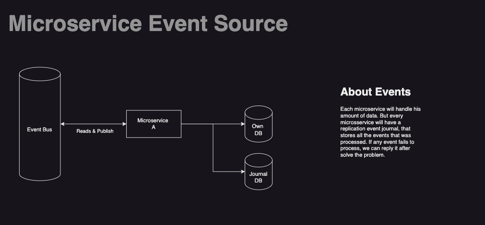
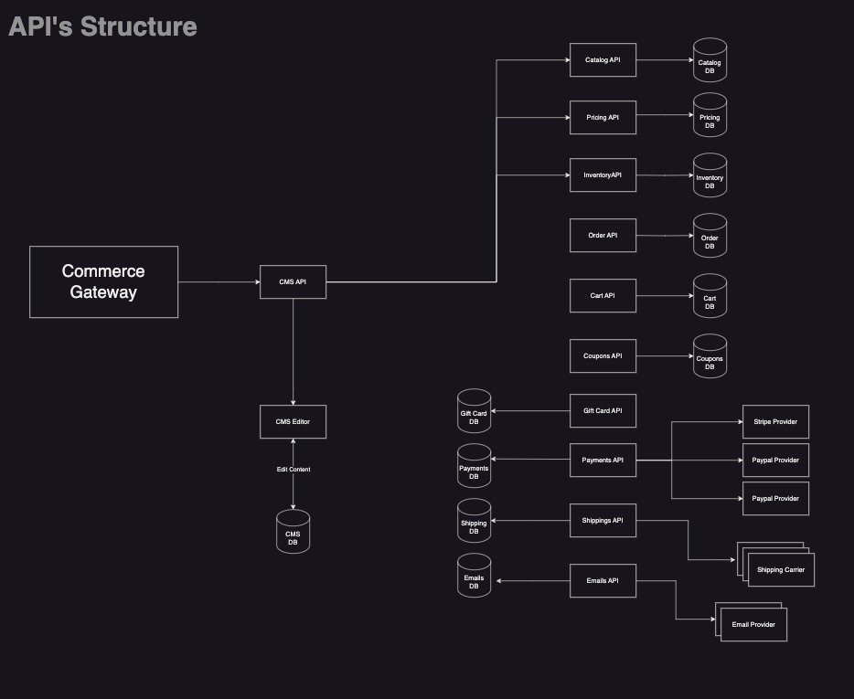
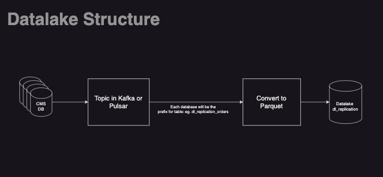
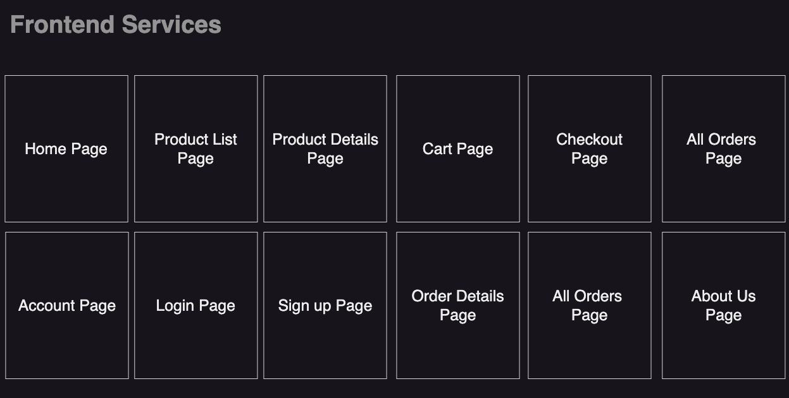

# Ecommerce Project
The ecommerce module from TBTB

## Architecture

Describing more about how this project works, we have four important topics to handle.

### Microservices

Each microservice will handle your data. And every microsservice will have a replication event journal, that stores all the events that was processed. If any event fails to process, we can reply it after solve the bug.

### Ecommerce API Microsservices

### Data replication and Data Lake

### Frontends

